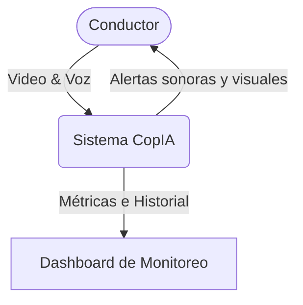
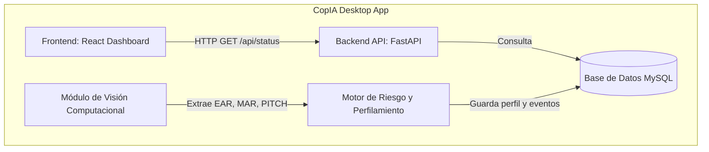
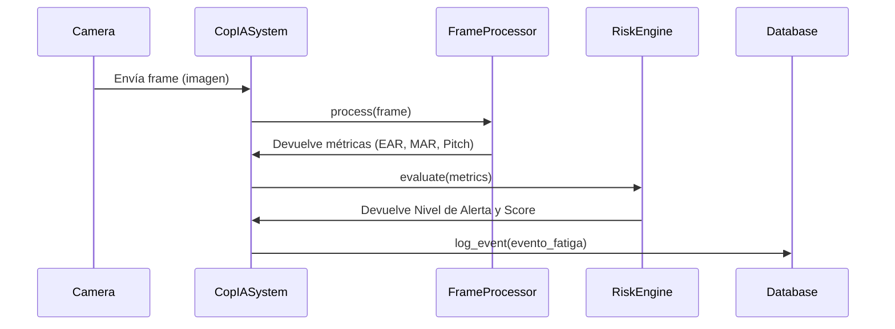

# CopIA: Arquitectura del Sistema

El sistema CopIA está diseñado bajo un enfoque modular, integrando visión computacional, análisis temporal de inteligencia artificial y una interfaz de usuario interactiva (Dashboard).

## 1. Diagrama de Contexto (C4 Nivel 1)

## 2. Diagrama de Contenedores (C4 Nivel 2)

## 3. Diagrama de Componentes: Procesamiento de Video

## 4. Estructura de Base de Datos

- **Conductor:** Información básica del usuario.
- **PerfilCalibracion:** Baselines (EAR, MAR) adaptados al conductor específico.
- **SesionConduccion:** Registro de inicio y fin de uso del sistema.
- **EventoFatiga:** Histórico inmutable de alertas generadas.
